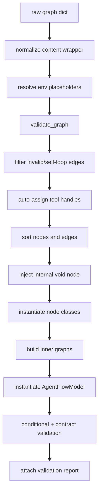

# Architecture

This page documents the current build-side architecture from the codebase.

## Main modules

| Path | Role |
| --- | --- |
| `magic_agents/agt_flow.py` | Graph normalization, validation, node factory, recursive inner-flow build |
| `magic_agents/node_system/` | Node implementations and graph sorting helpers |
| `magic_agents/models/factory/` | Pydantic-style graph/node/edge models |
| `magic_agents/execution/` | Reactive runtime, dispatchers, loop execution, conditional bypass |
| `magic_agents/hooks/` | Flow hook protocols, runtime config, execution-scoped registry |
| `magic_agents/debug/` | Debug config, observers, emitters, execution summaries |
| `magic_agents/mcp/` | MCP session management, discovery, namespacing, dispatch |
| `magic_agents/util/` | Graph validation, handle registry, env resolution, template helpers |

## Build pipeline

## Build details worth knowing

### 1. Input normalization

`build()` accepts either:

- a flat graph dict with `nodes` and `edges`
- a nested wrapper with `content.nodes` and `content.edges`

### 2. Environment placeholder resolution

Only `{{env.VAR_NAME}}` is resolved at build time by `resolve_env_placeholders()`.

Other Jinja-like placeholders such as `{{ handle_user_message }}` are preserved for runtime templating.

### 3. Structural validation

`validate_graph()` currently enforces:

- exactly one `user_input` node
- no duplicate edges with the same `(source, target, sourceHandle, targetHandle)`
- existing source/target node references
- self-loop detection

Those are only the first-pass structural checks. After node/edge instantiation, the build path also runs conditional validation plus the broader contract-validation chain documented in [VALIDATION.md](VALIDATION.md).

### 4. Tool-edge backfilling

Before node creation, `_assign_tool_handles()` inspects edges from tool-capable nodes (`fetch` in `tool_mode`, `python_exec`, `mcp`) into `llm` nodes.

It auto-fills:

- `sourceHandle` based on the provider node
- `targetHandle` as `handle-tool-definition-N` when missing

Exception: `python_exec` has two modes. When its node data includes `code`, it runs as a normal graph node and `_assign_tool_handles()` intentionally skips automatic tool-handle assignment (`agt_flow.py:210-216`). In that node-mode case, existing handles are preserved so the result can route through graph edges instead of being treated as an LLM tool definition. Omit `data.code` only when you want `python_exec` to behave as a tool provider for an LLM.

### 5. Sorting and positioning

`sort_nodes()` uses `perform_topological_sort()` plus automatic positions for nodes with missing or default positions.

Important nuance: `perform_topological_sort()` falls back to graph insertion order when `networkx.topological_sort()` is unfeasible. That is why cycle behavior needs careful documentation; see [VALIDATION.md](VALIDATION.md) and [../issues/cycle-behavior-and-doc-drift.md](../issues/cycle-behavior-and-doc-drift.md).

### 6. Internal `void` sink injection

Build always appends an internal `void` node and rewrites edges targeting `handle-void` to that node.

`end` nodes also get an automatic edge to the internal sink.

### 7. Node factory

`create_node()` maps JSON node `type` to:

- a runtime node class
- an optional model class for validation/coercion

This is also where aliases such as `json_mode -> json_output` or `provider -> engine` get normalized through node models.

The runtime factory currently maps **17** node types, including `constant` and `hook`, which were missing from older wiki pages.

### 8. Recursive inner graphs

`inner` nodes carry embedded `magic_flow` JSON. During build, each valid nested graph is built recursively and attached as `node.inner_graph`.

## Runtime-relevant architecture pieces

Even though execution is covered in detail elsewhere, these components are part of the architecture boundary:

- `GraphEventDispatcher` — dependency maps, input trackers, bypass propagation
- `NodeInputTracker` — readiness/bypass bookkeeping per node, keyed by edge ID for correct fan-in tracking
- `ConditionalRouting` protocol — runtime contract for conditional-like nodes
- `GraphDebugFeedback` — whole-graph execution summary
- `RuntimeConfig` / `HookRegistry` — graph/node lifecycle hook registration and invocation
- `ObserverRegistry` — per-execution debug observer resolution (`NullObserver`, `DefaultObserver`, `CompositeObserver`)
- `CallbackEmitter` — module-level callback bridge for selected persisted execution/debug output consumers; see [../hooks/CALLBACK_EMITTER.md](../hooks/CALLBACK_EMITTER.md)

See [EXECUTION_MODEL.md](EXECUTION_MODEL.md).
