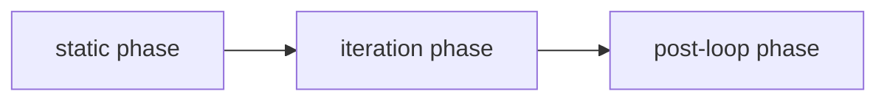

# Execution model

Magic Agents executes graphs reactively.

## Normal reactive execution

`execute_graph_reactive()` creates a task for every node up front.

Each node task:

1. waits for its inputs through `NodeInputTracker`
2. executes when ready
3. stores outputs keyed by handle name
4. propagates outputs through matching edges
5. emits streaming/debug events immediately through an output queue

`NodeInputTracker` readiness is edge-aware: incoming values are tracked by edge ID, not just by handle name. That matters for correct fan-in behavior when multiple edges target the same handle.

## Why this is reactive

There is no single imperative "walk the graph from master node" loop.

Instead:

- readiness comes from incoming edges
- nodes with no incoming edges are immediately ready
- multiple independent branches can execute concurrently
- output routing is handle-based, not node-type-based

That is why the legacy `master` field is currently ignored by the runtime. See [../issues/master-field-is-ignored.md](../issues/master-field-is-ignored.md).

## Event types you will see

| Event type | Meaning |
| --- | --- |
| `content` | user-facing streaming chunk or streaming-like content |
| `debug` | structured debug/error payload |
| `debug_summary` | final graph debug summary |
| `loop_progress` | per-iteration loop progress event |
| handle name such as `handle_generated_content` | internal routed node output |

## Handle-driven routing

Nodes emit events with `yield_static(content, content_type=...)`.

The executor then:

1. matches `edge.sourceHandle`
2. sends the payload into the target node under `edge.targetHandle`

If an edge has `hooks` configured and enabled, the dispatcher can also invoke the referenced `hook` node as part of edge traversal.

See [HANDLES_AND_ROUTING.md](HANDLES_AND_ROUTING.md).

## Hook lifecycle integration

The executor integrates a hook system in addition to debug observers.

- graph-level hooks come from `RuntimeConfig` / `HookRegistry`
- graph instances can also carry a graph-level `hooks` object on `AgentFlowModel`
- lifecycle callbacks include graph start/end/error, node start/end/error/bypass, and LLM/tool-specific hook points
- hook failures are isolated and logged; hooks are observer-style and are not supposed to mutate control flow

There is also a `hook` node type (`NodeHook`) that executes a Python function template with a `HookContext` input and dedicated user/debug/feedback outputs.

## Conditional routing and bypass

Conditional execution is protocol-based.

- a conditional-like node exposes `condition_template` before execution
- after execution it persists `selected_handle`
- the executor bypasses non-selected downstream branches recursively
- `__bypass_all__` is used for error cases where no branch should continue

If a conditional selects a handle with no matching outgoing edge, the executor emits a `GraphRoutingError` debug event and bypasses all downstream targets.

## Loop execution

If any node is a `NodeLoop`, execution switches to `execute_graph_loop_reactive()`.

That executor uses three phases:

### Static phase

- runs nodes that must complete before the loop starts
- excludes nodes that depend on `loop.handle_end`
- can still execute conditionals if their inputs are available

### Iteration phase

For each item in the list:

1. emit `handle_item`
2. run the iteration subgraph in topological order
3. collect feedback sent back into `handle_loop`
4. append that feedback into the aggregation array

`llm` nodes only re-run per iteration when `data.iterate: true`.

### Post-loop phase

- the loop writes the aggregated array to `handle_end`
- downstream post-loop nodes execute in topological order

## Timeout behavior

`AgentFlowModel.timeout` defaults to 60 seconds and is passed to the dispatcher/input trackers as the per-node input wait timeout.

If a node waits longer than that for required inputs, the executor emits a debug error and propagates downstream bypass/error handling.

## Streaming behavior

- nodes with `OUTPUT_HANDLE_CONTENT` can emit user-visible streaming events
- `llm` emits `content` chunks while streaming
- `send_message` emits a `content` event immediately
- `inner` forwards child streaming chunks in real time

## Debug behavior

When `graph.debug` is enabled:

- validation issues are emitted as `debug`
- node-level debug info can be emitted after execution
- a final `debug_summary` is emitted after the graph finishes

The actual observer chain is more nuanced than "debug on/off":

- if global debug is disabled, execution gets a `NullObserver`
- if `graph.debug` is false, execution gets a `NullObserver`
- if `debug_config.enabled` resolves to false, execution gets a `NullObserver`
- otherwise `ObserverRegistry.create(...)` builds a `DefaultObserver`
- nodes with custom observers can be merged with the graph observer through `CompositeObserver`

See [DEBUG_SYSTEM.md](DEBUG_SYSTEM.md).
