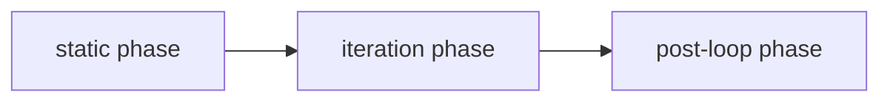

# Execution model

Magic Agents executes graphs reactively.

## Normal reactive execution

`execute_graph_reactive()` creates a task for every node up front.

Each node task:

1. waits for its inputs through `NodeInputTracker`
2. executes when ready
3. stores outputs keyed by handle name
4. propagates outputs through matching edges
5. emits streaming/debug events immediately through an output queue

`NodeInputTracker` readiness is edge-aware: incoming values are tracked by edge ID, not just by handle name. That matters for correct fan-in behavior when multiple edges target the same handle.

## Why this is reactive

There is no single imperative "walk the graph from master node" loop.

Instead:

- readiness comes from incoming edges
- nodes with no incoming edges are immediately ready
- multiple independent branches can execute concurrently
- output routing is handle-based, not node-type-based

That is why the legacy `master` field is currently ignored by the runtime. See [../issues/master-field-is-ignored.md](../issues/master-field-is-ignored.md).

## Event types you will see

| Event type | Meaning |
| --- | --- |
| `content` | user-facing streaming chunk or streaming-like content |
| `debug` | structured debug/error payload |
| `debug_summary` | final graph debug summary |
| `loop_progress` | per-iteration loop progress event |
| handle name such as `handle_generated_content` | internal routed node output |

## Handle-driven routing

Nodes emit events with `yield_static(content, content_type=...)`.

The executor then:

1. matches `edge.sourceHandle`
2. invokes an enabled edge Hook, when configured, and waits for its callback to finish
3. sends the original payload into the target node under `edge.targetHandle`

The referenced `hook` node always runs before the payload reaches that target. Its returned events are emitted separately and do not replace the payload. Hook errors and timeouts are isolated; the original payload is still forwarded.

See [HANDLES_AND_ROUTING.md](HANDLES_AND_ROUTING.md).

## Hook lifecycle integration

The executor integrates a hook system in addition to debug observers.

- graph-level hooks come from `RuntimeConfig` / `HookRegistry`
- graph instances can also carry a graph-level `hooks` object on `AgentFlowModel`
- lifecycle callbacks include graph start/end/error, node start/end/error/bypass, and LLM/tool-specific hook points
- hook failures are isolated and logged; hooks are observer-style and are not supposed to mutate control flow

There is also a `hook` node type (`NodeHook`) that executes a Python function template with a `HookContext` input and dedicated user/debug/feedback outputs.

## Conditional routing and bypass

Conditional execution is protocol-based.

- a conditional-like node exposes `condition_template` before execution
- after execution it persists `selected_handle`
- the executor bypasses non-selected downstream branches recursively
- `__bypass_all__` is used for error cases where no branch should continue

If a conditional selects a handle with no matching outgoing edge, the executor emits a `GraphRoutingError` debug event, marks the conditional as a failed node (the run ends with `on_graph_error`, and a sub-flow that hits it fails its Inner Flow node) and bypasses all downstream targets. Both executors (static and loop) treat it the same way.

## Node failures and the error cascade

A node fails when it raises, times out waiting for its inputs, or emits `__bypass_all__`. The executor marks it `ERROR`, emits an error frame (`node_id`, `error_type`, `error_message`; `error_code` when the failure is a typed `OperationFailure`, and a sanitized `context` for Fetch), and the run ends with `on_graph_error` instead of `on_graph_end`. Nothing the failed node yielded is delivered downstream.

The cascade is edge-scoped. Each outgoing edge of the failed node is marked bypassed; a downstream node is bypassed (reason `upstream_error`, recursively) only when **all** its incoming edges are bypassed. A fan-in node keeps waiting for its other in-flight inputs and runs once with what arrived, so the outcome does not depend on which producer finishes first. A node that receives nothing is skipped.

An edge whose source completed without emitting that handle (a silent handle) is neither delivered nor bypassed, so a node that waits on it times out after the graph `timeout`, even when another of its inputs failed. Before the edge-scoped cascade, a sibling's failure bypassed such a node at once; now only its failed input is bypassed and the silent one is still awaited.

### Result sink

`execute_graph_reactive(..., result={})` (and `execute_graph_loop_reactive`) fill the dict when the run finishes: `has_errors` (any node ended in `ERROR`, or blocking validation aborted the run), `failed_nodes`, `summary` (`get_execution_summary()`) and `node_errors` (`{node_id: {error_type, error_code, retryable}}`; `retryable` is set only for typed failures, and a failed Inner Flow also has `cause_path`). Inner Flow step and tool mode use it to decide whether the sub-flow failed.

### Inner Flow failures

An Inner Flow fails when a node of its sub-flow ends in `ERROR` (child node state, not the presence of diagnostic frames: a `JSONParseError` diagnostic recovered by a Hook leaves the sub-flow successful). The Inner node then emits `SUBGRAPH_END` with `status: "error"` and raises `OperationFailure("INNER_FLOW_FAILED")`, so it is an ordinary failed node: downstream is bypassed, `on_node_error` fires, and `onError` / `onFinish` lifecycle Hooks on it see the typed outcome and can recover it. The partial result is not delivered; it is in `error.details.partial_content`. This holds for a failure the sub-flow tolerates too (a Loop item that fails, a fan-in that renders with the other inputs): an `onError` Hook can adopt `partial_content` to keep the degraded Result. See [../nodes/inner.md](../nodes/inner.md).

## Loop execution

If any node is a `NodeLoop`, execution switches to `execute_graph_loop_reactive()`.

That executor uses three phases:

```mermaid
flowchart LR
  A[static phase] --> B[iteration phase]
  B --> C[post-loop phase]
```

### Static phase

- runs nodes that must complete before the loop starts
- excludes nodes that depend on `loop.handle_end`
- can still execute conditionals if their inputs are available

### Iteration phase

For each item in the list:

1. clear the previous iteration's values: every input that an iteration node receives from the loop item or from another iteration node is removed (inputs from pre-loop nodes are kept)
2. emit `handle_item`
3. run the iteration subgraph in topological order
4. collect feedback sent back into `handle_loop`
5. append that feedback into the aggregation array (`null` when nothing was fed back)

Within an iteration a node runs with whatever arrived **for this item** and is skipped when none of its in-iteration edges (from the loop item or from another iteration node) delivered a value, because the producers failed, were bypassed or stayed silent in this iteration. Pre-loop inputs (a Client, a fixed Text, tool definitions) are the same for every item, so on their own they never make a node run: an `llm` whose message producer failed is skipped, not called without a message. A node with at least one in-iteration value runs without the missing ones (for example a step fed by the item and by a failed step).

- A skipped node reports `on_node_bypass` with reason `upstream_error` (metadata `phase: "iteration"`, `iteration`, `upstream_error_node`) when a producer failed in this item, and `not_ready` when its producers were silent or bypassed. Failure-caused bypasses in the static and post-loop phases also report `upstream_error`, like the reactive executor.
- A node never runs with another item's value. The aggregated slot is `null` when the feedback node failed or was skipped; when the feedback node still ran with a partial input, the slot holds what it produced.
- A node that fails in any iteration keeps the run's status failed (`on_graph_error`).

`llm` nodes only re-run per iteration when `data.iterate: true`.

### Post-loop phase

- the loop writes the aggregated array to `handle_end`
- downstream post-loop nodes execute in topological order

## Timeout behavior

`AgentFlowModel.timeout` defaults to 60 seconds and is passed to the dispatcher/input trackers as the per-node input wait timeout.

If a node waits longer than that for required inputs, the executor emits a debug error and propagates downstream bypass/error handling.

## Streaming behavior

- nodes with `OUTPUT_HANDLE_CONTENT` can emit user-visible streaming events
- `llm` emits `content` chunks while streaming
- `send_message` emits a `content` event immediately
- `inner` forwards child streaming chunks in real time

## Debug behavior

When `graph.debug` is enabled:

- validation issues are emitted as `debug`
- node-level debug info can be emitted after execution
- a final `debug_summary` is emitted after the graph finishes

The actual observer chain is more nuanced than "debug on/off":

- if global debug is disabled, execution gets a `NullObserver`
- if `graph.debug` is false, execution gets a `NullObserver`
- if `debug_config.enabled` resolves to false, execution gets a `NullObserver`
- otherwise `ObserverRegistry.create(...)` builds a `DefaultObserver`
- nodes with custom observers can be merged with the graph observer through `CompositeObserver`

See [DEBUG_SYSTEM.md](DEBUG_SYSTEM.md).
