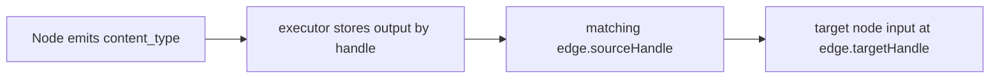

# Handles and routing

Handles are the routing contract of the graph runtime.

## The protocol

Every routed output is created with:

```python
yield self.yield_static(content, content_type="some_handle")
```

That becomes an event whose `type` is the source handle.

An edge then maps:

- `sourceHandle` — which output to read from the source node
- `targetHandle` — the input key to store on the target node

## Routing flow



## Important defaults

| Node type | Default output handles |
| --- | --- |
| `user_input` | `handle_user_message`, `handle_user_files`, `handle_user_images`, `handle_client_extras` |
| `text` | `handle_text_output` |
| `constant` | `handle_constant_output` |
| `parser` | `handle_parser_output` |
| `fetch` | `handle_fetch_output` or tool definition handle in tool mode |
| `client` | `handle-client-provider` |
| `llm` | `handle_streaming_content`, `handle_generated_content`, `handle-tool-calls` |
| `chat` | `handle_chat_output` |
| `send_message` | `content`, `handle_message_output` |
| `loop` | `handle_item`, `handle_end` |
| `conditional` | dynamic output handle chosen by the condition |
| `inner` | `handle_content_stream`, `handle_execution_content`, `handle_execution_extras` |
| `end` | `handle_end_output` |
| `python_exec` | `handle-tool-definition` |
| `mcp` | `handle-tool-definition` |
| `hook` | `handle-user-output`, `handle-debug-output`, `handle-feedback-output` |

## Legacy handle migration

**⚠️ Clean-break policy**: Legacy handle `handle_generated_end` is no longer emitted by any node. Graphs using this handle will fail validation.

Previous versions emitted `handle_generated_end` from:
- `llm` → now emits `handle_generated_content`
- `parser` → now emits `handle_parser_output`
- `send_message` → now emits `handle_message_output`

The `end` node input handle changed from `handle_generated_end` to `handle_flow_input`.

Users must reconnect edges manually after migration. See [JSON_CONTRACT.md](../JSON_CONTRACT.md) for complete contract.

## Handle overrides

Most nodes allow overrides through `data.handles`.

Example:

```json
{
  "type": "llm",
  "data": {
    "handles": {
      "output_generated": "answer",
      "output_content": "stream"
    }
  }
}
```

## Tool routing nuance

Tool-capable nodes routed into an `llm` use special handle assignment.

- `fetch` in `tool_mode` uses its configured output handle
- `python_exec` and `mcp` use `handle-tool-definition`
- `build()` can auto-fill missing `targetHandle` values as `handle-tool-definition-0`, `handle-tool-definition-1`, and so on

That auto-fill behavior is specific to tool-capable nodes routed into `llm`; it is not a generic missing-handle rule for the whole graph.

## Target-side validation matters now

Routing is no longer documented only from the source side.

- `sourceHandle` is validated against the source node contract
- `targetHandle` is also validated against the target node contract
- multiple edges into the same `targetHandle` are checked against port cardinality / fan-in rules

See [VALIDATION.md](VALIDATION.md) for the exact enforcement nuances and current `warn`/`shadow`/partial-`strict` behavior.

## `handle-void`

`handle-void` is a special internal sink handle.

During build, edges targeting `handle-void` are rewritten to the injected internal `void` node.

## Edge-level hooks

Edges can carry optional `hooks` config through `EdgeNodeModel.hooks`.

When enabled and bound to a valid `hook` node, the dispatcher invokes that hook as the edge is traversed.

## Conditional signals are not normal handles

Reserved system signals:

- `__bypass_all__`
- `__default__`
- `__error__`
- `__timeout__`

Those are executor/control signals, not user-defined branch handles.

## Practical advice

- be explicit with `sourceHandle` and `targetHandle`
- document custom handles in shared graph specs
- use canonical handles only — legacy handles are rejected at validation

See [VALIDATION.md](VALIDATION.md) for what the build catches and [JSON_CONTRACT.md](../JSON_CONTRACT.md) for the complete contract.
