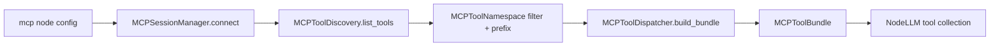

# MCP integration

`mcp` nodes expose external MCP tools to `llm` nodes.

## The pipeline

## Current v1 behavior

- one server per `mcp` node at runtime
- supported transports: `stdio`, `http`
- tool names can be prefixed to avoid collisions
- allowlist and denylist can filter discovered tools
- cleanup runs in `finally`

## LLM integration

`NodeLLM._collect_tools()` detects bundle-like values with:

- `tool_schemas`
- `tool_functions`

It flattens them into the LLM tool set and raises collision errors if names overlap.

## Recommended pattern

`mcp -> llm`

Let build auto-assign the `handle-tool-definition-N` target handle when possible.

## See also

- [../nodes/mcp.md](../nodes/mcp.md)
- [GRAPH_FORMAT.md](GRAPH_FORMAT.md)
- [HANDLES_AND_ROUTING.md](HANDLES_AND_ROUTING.md)
