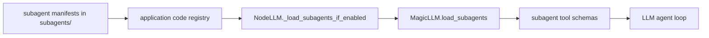

# Task subagents

Task subagents are loaded through MagicLLM, but Magic Agents still exposes the application-side toggle and code registry wiring.

## Current ownership boundary

From the current code:

- MagicLLM owns `load_subagents()` and the runtime subagent bundle
- Magic Agents keeps `enable_task_subagents()`, `disable_task_subagents()`, `is_task_subagents_enabled()`, and `get_code_registry()` in `agt_flow.py`
- `NodeLLM.process()` calls `client.load_subagents(manifest_dir, code_registry)` when enabled

## How they reach an LLM node



## Repo examples

Current bundled example manifest:

- `subagents/research.web.agent.yaml`
- `subagents/research.web.md`
- `subagents/research_web.py`

## Registration model

1. YAML manifest defines identity and schema
2. Python callable is decorated with MagicLLM's `@subagent(..., registry=...)`
3. `NodeLLM` loads manifests from the `subagents/` directory when the feature is enabled

## Current feature toggle API

```python
from magic_agents.agt_flow import enable_task_subagents, disable_task_subagents
```

## Known caveats

- the feature is off by default
- docs that import from `magic_agents.subagents` are stale for the current codebase
- Magic Agents currently documents only one sample subagent: `research.web`

If you need historical drift details, see [../issues/task-subagent-docs-drift.md](../issues/task-subagent-docs-drift.md).
